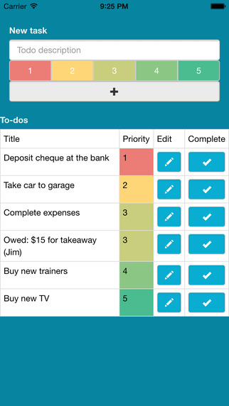
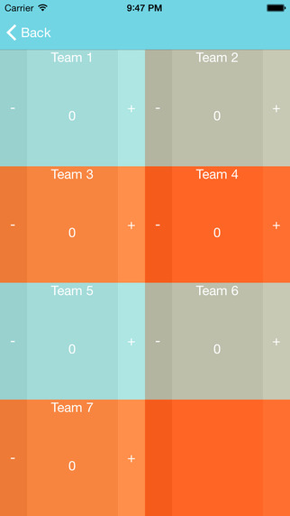

## Priority Todo

Priority Todo is a bare bones task manager that automatically sorts tasks by the priority assigned to them.

 
Despite there already being 100's of todo lists apps on the store, I couldn't find a simple app that did what I wanted. For a few weeks I was using a Google Sheets doc with some automated sorting to manage tasks. That solution was a bit cumbersome on my phone (editing Sheets on touch screens is a PITA), so I thought I may as well write an app with a more convenient interface.

 
The app is written in HTML & Javascript. It uses Bootstrap for layout, HTML5 localStorage to retain task data and Cordova for app generation.

 

 

## Score Tracker

An iOS app written in Swift for keeping score in sports, multiplayer board games etc.
I wrote this one over the Christmas 2014 period to track team scores when playing [Heads Up!](https://itunes.apple.com/us/app/heads-up%21/id623592465?mt=8), Pictionary and some other games with friends & family.

 

 
